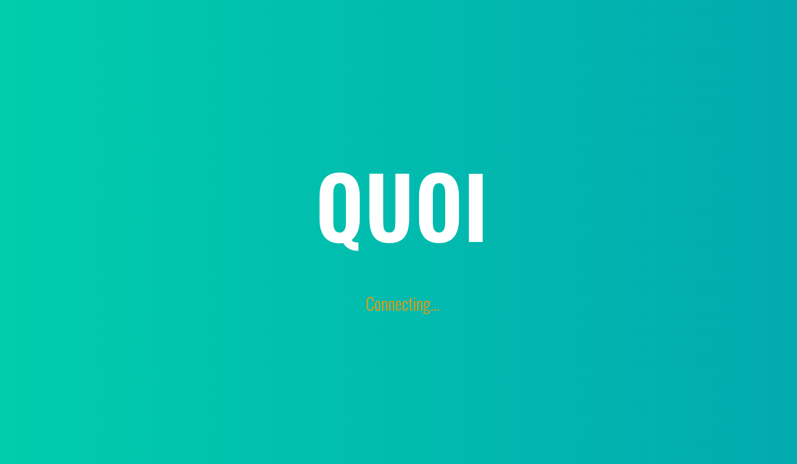
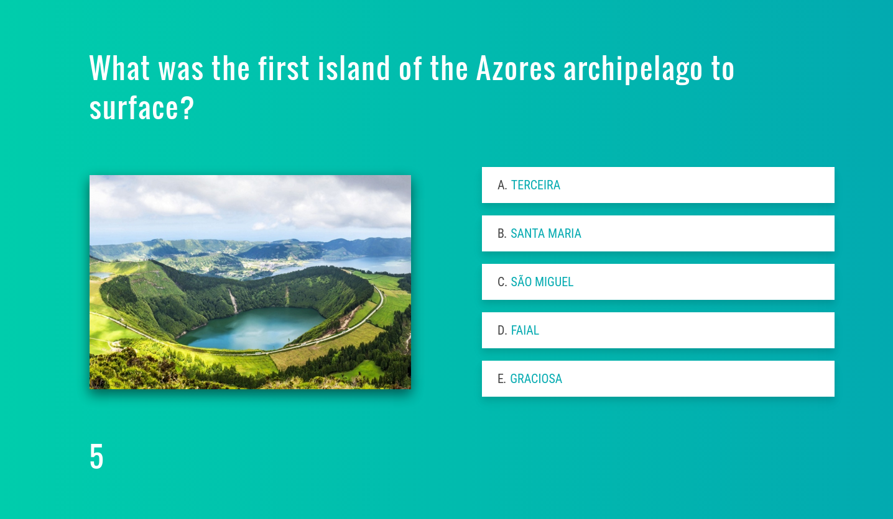
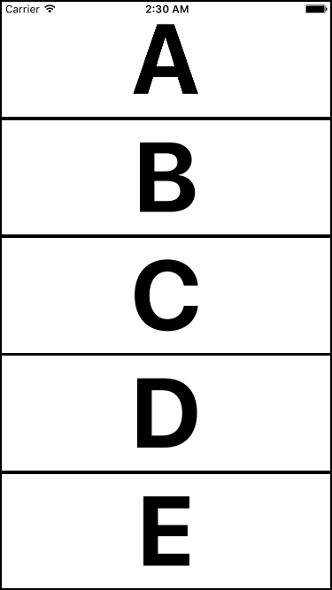

# quoi-app
A mobile quiz app inspired by Buzz and Dr. Why.
Coded during [Whitesmith's Birthday Week in Loural][ws-retreat]; this was the
result of a two day hackathon, so it is _unpolished_.

It will probably suffer a refactor before we can show it the love it deserves.

Check what Quoi will become [in the future](#future-work) and give us some
feedback.

[ws-retreat]: https://twitter.com/Whitesmithco/status/715199690669744128

## Motivation
Whitesmith loves quizzes. Everytime we gather our
[Quiz Master][quiz-master] always prepares a movie-book-nerd-random kind of
quiz.

We thought it would be fun to implement a Quiz app for mobile phones (where the
fastest team gets more points) during Whitesmith's 4th anniversary celebration week.

[quiz-master]: https://github.com/ruimagalhaes

## Overview
This app is composed by two components: the [mobile app][] and the server
(this repo). This repo contains the Electron application that runs the game
server, the Game Master controls (e.g.: next question, show ranking, etc.) and
the screen that is displayed on the TV/projector.

[mobile app]: https://github.com/whitesmith/quoi-mobile

## Usage
**TODO: instructions on how to run the application.** Currently this only has
a development environment, since it is missing the Electron application
packaging.

1. Start the server/application as described in the [Development](#development)
section.
2. After opening the Game Master window, click on the "Choose file" button in order
to submit the questions CSV. It should follow the structure of the provided
example, [questions.sample.csv](./questions.sample.csv).

## Screenshots
**Initial TV screen**

**TV**

**Mobile**

## Development
### All

1. **Run** `npm install`

### Server

1. **Run** `npm run start:server`

### GameMaster and TV apps server

1. **Run** `npm run start:web` and **either**
    1. **Run** the desktop app in development mode (instructions
[below](#electron-app)) **or**
    1. Access [TV][tv-livereload] and [GameMaster][gamemaster-livereload] on your browser. These pages have live reload enabled. Notice they end with `?development`; this is used by the client to detect what scripts should it load (and from where); without it it won't work in a browser.

### Electron app

1. **Run** `npm run start:app` (an alias of `npm run start:app:client`).

This runs the application in development mode, which will load both web
applications (TV and GameMaster) with **live reload** enabled; the `:client`
part **disables the internal server**, which is what you want most of the time.

If you want to test the internal server run `npm run start:app:with-server` instead.

[tv-livereload]: http://localhost:8080/webpack-dev-server/game/public/tv.html?development
[gamemaster-livereload]: http://localhost:8080/webpack-dev-server/game/public/master.html?development

### DevTools for game-master and tv

The following steps are not required, but I strongly recommend you to install this:

1. https://chrome.google.com/webstore/detail/react-developer-tools/fmkadmapgofadopljbjfkapdkoienihi
2. https://chrome.google.com/webstore/detail/redux-devtools/lmhkpmbekcpmknklioeibfkpmmfibljd

You'll have two new tabs in Chrome for React and Redux. They're awesome.

## TODO (urgent)
**Electron application packaging and instructions.**

## Future Work
The mobile app should be able to connect "automatically" to the server, either
through service discovery or QR code scanning. The latter would allow the game
to be played through the Internet (by tunnelling the TV screen).

The player/team should be able to take a photo when starting the game, so it
becomes his/her avatar throughout the game (that shows in the ranking).

The Game Master view needs... some "design help". The mobile app should be
designed to match the TV look (only the TV view had a designer's help :( ).

It should be possible to download questions from other sources (instead of
having to upload a CSV file); some kind of trivia data bank that can be
retrieved by anyone, and curated by anyone as well.
